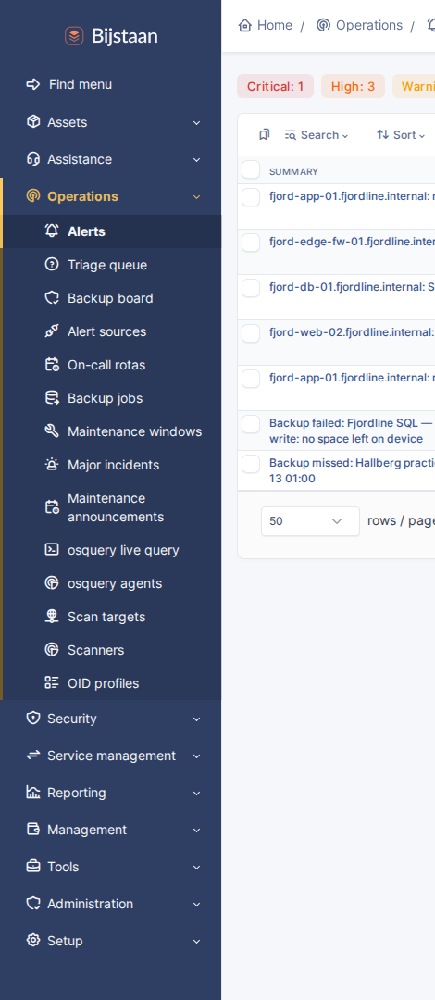
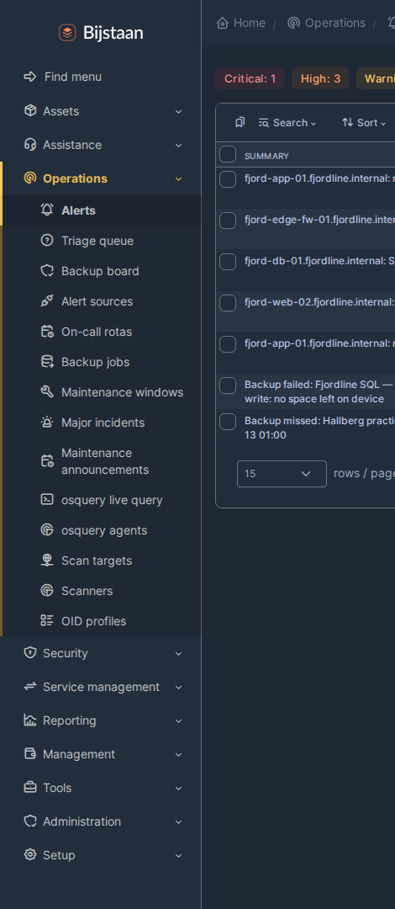
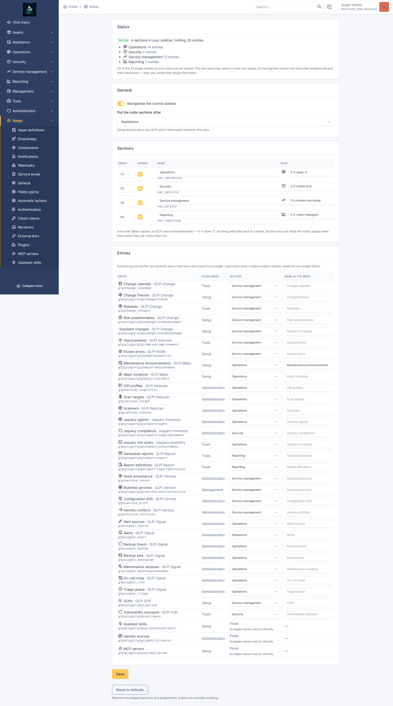

# GLPI Nav

Gives the Bijstaan suite its own top-level sections in GLPI's central sidebar,
instead of twenty-odd entries scattered through Tools, Setup, Administration and
Management.

A coordinator, not a feature: it owns no tables, adds no pages beyond its
settings screen, and never creates a menu entry. It only moves ones core already
built, through `Hooks::REDEFINE_MENUS`.



## The problem it solves

`menu_toadd` appends an itemtype to one of core's seven fixed sectors. A plugin
cannot create a sector or ask for one. With a suite installed that produces:

| Sector | What ends up there |
|---|---|
| **Administration** | LDAP, profiles, entities … *and* alert sources, on-call rotas, backup jobs, the triage queue, identity conflicts, configuration drift |
| **Setup** | mail receivers, OAuth clients, automatic actions … *and* change freezes, standard changes, known errors, major incidents |
| **Tools** | reminders, RSS, saved searches … *and* the vulnerability dashboard, the change calendar, releases, report definitions |

The grouping describes which plugin supplied a page rather than what a
technician is doing. Core offers no setting, profile option or hook that
reorders the sidebar.

## Sections

Four, inserted after Assistance by default:

- **Operations** — alerts, triage, backup board, alert sources, on-call rotas,
  backup jobs, maintenance windows, major incidents, maintenance announcements,
  the osquery live query console and agent fleet, scan targets, scanners, OID
  profiles
- **Security** — vulnerability exposure dashboard, advisories, EOL, review queue
  and exceptions; osquery fleet compliance
- **Service management** — change calendar and success rate, releases, risk
  questionnaires, change freezes, standard changes, known errors, SOPs,
  improvements, business services, asset provenance, identity conflicts,
  configuration drift
- **Reporting** — report definitions, generated reports

All configurable: sections can be renamed, re-iconed, reordered, hidden, or
anchored after a different core sector; entries can be reassigned or left where
their plugin filed them, and relabelled. There is a Reset to defaults button.
Saving takes effect on the next page render, not the next login.



## Moving an entry is two changes, not one

`Html::header($title, $url, $sector, $item, $option)` is not decoration. GLPI
resolves three things by looking those arguments up in the menu array:

- the **breadcrumb**, from `menu[sector]['title']` and
  `menu[sector]['content'][item]`
- the **Add button**, from
  `menu[sector]['content'][item]['options'][option]['links']['add']`
  (`templates/layout/parts/context_links.html.twig`)
- the **sidebar highlight**, both levels, by comparing *titles*

Move an entry while its pages still name the old sector and all three vanish,
with the page rendering fine and reporting nothing. Measured across thirteen
pages: every one lost its Add button, breadcrumb entry and highlight.

So a movable entry is one whose pages ask where they live:

```php
$sector = class_exists(Nav::class) ? Nav::sector(KnownError::class, 'config') : 'config';
Html::header(KnownError::getTypeName(2), $_SERVER['PHP_SELF'], $sector, KnownError::class);
```

The `class_exists()` guard and the fallback argument keep that line safe without
this plugin installed, switched off, or with the entry left in place.

Title matching has a second edge: two entries with the same name in one section
both highlight, on either page. Hence the per-entry label override and the
settings-page warning when two names collide.

## Install

```bash
# from the GLPI root
git clone https://github.com/bijstaan/glpi-nav.git plugins/glpinav
php bin/console plugin:install -u glpi glpinav
php bin/console plugin:activate glpinav
```

Uninstall removes five config rows and one right. The stock layout returns
because the transform stops running and every patched page falls back to the
sector it already names.

## Settings

**Setup → Plugins → GLPI Nav.** Needs `plugin_glpinav_config`, granted at
install to profiles holding core `config` UPDATE.



| Setting | Default | What it does |
|---|---|---|
| Reorganise the central sidebar | on | Master switch. Off leaves GLPI's layout untouched |
| Put the suite sections after | Assistance | Which core sector the sections follow. Setup stays last; core pins it |
| Sections | four, as above | Order, visibility, name, Tabler icon. Keys are fixed — 51 pages name them |
| Entries | as above | Per entry: which section (or leave in place), and the label to show |

## Limitations

- **Central interface only.** The helpdesk portal is untouched by design.
- **Not every entry can be moved.** glpiai's MCP servers and Assistant skills,
  and glpiidentity's sources, name their sector directly in their pages. They
  are listed as Fixed on the settings page. A plugin that adopts the
  `Nav::sector()` call above becomes movable by adding its keys to
  `Registry::MOVABLE`.
- **It cannot reveal anything.** Entries are moved, never created, so a section
  is exactly as visible as its contents, and one whose contents a profile cannot
  see is not rendered at all. This is not a substitute for a profile.
- **Section membership is per instance, not per profile.**
- `Html::getMenuSectorForItemtype()` still answers with the stock sector — it
  reads the `types` list, which the transform leaves alone. Core uses it only
  for item templates and manual links.

## Licence

GPL-3.0-or-later, the same licence as GLPI. The plugin is loaded into GLPI's
process and extends its classes, so it is a derivative work. See
[LICENSE](LICENSE).
